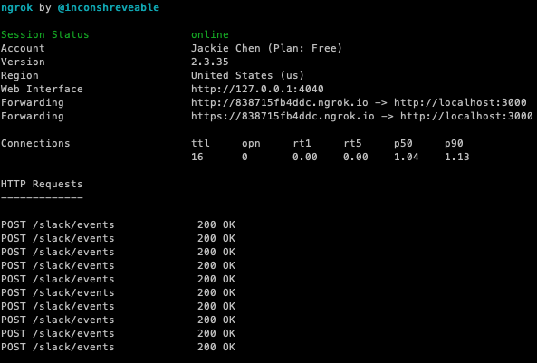

# Slack FAQ Bot

## Overview

Slack FAQ Bot is a Bot that answers FAQ automatically in slack.


## How does Bot work?

The Bot is hosted in AWS Lambda.

- When the keyword `help` is deteced in the Slack channel, the Bot will provide a FAQ list from where user can select what they are intereted.

- When some keywords (e.g `firewall`) are deteced in the Slack channel, the Bot will reply the relevant information.

## How to add/remove/update request type?

All request types are defined in the [requesttype.js](./lib/requesttype.js) file. The Bot reads the file then generates the contents for Slack. 

For example, this is how the `Open AWS Account` request type looks like in Slack:


And this is the source code:

```
  "request_firewall_change": {
    "name": "Request Firewall Change",
    "description": "Firewall change is required for network communication between VPC and on-prem data centre.",
    "url": "https://www.google.com",
    "references": [
      {
        "title": "Firewall Information and Requests",
        "url": "https://www.google.com"
      }
    ]
  }
```
## How to setup the Bot in Slack and Lambda?

1. Create a new app in Slack.

2. In `OAuth & Permissions`, set up the Bot token scope.

  

3. Install the app in the workspace.

4. Get Bot credential.

  - Get `Signing Secret` in `Basic Information`, and use it for the environment variable `SLACK_SIGNING_SECRET`.
  
  - Get `OAuth Tokens for Your Team` in `OAuth & Permissions`. then use it for the environment vairable `SLACK_BOT_TOKEN`.

5. Setup AWS credential.

6. Setup local project `npm install`.

7. Deploy to Lambda `npx serverless deploy`. Take a note of the returned URL, e.g `https://abcdefg.execute-api.ap-southeast-2.amazonaws.com/dev/slack/events`.

8. Go back to the Slack app settings `Event Subscriptipons`, copy and paste the above URL in the `Request URL`. Also add the subscription to bot events.

  

9. Go to `Interactivity & Shortcuts`, then use the same URL for the `Request URL`.

  

10. Time to test the new Bot in Slack!

## How to test the Bot locally?

1. Start the bot locally -  `npx serverless offline --noPrependStageInUrl`.

2. Create a public endpoint and map it to the local port 3000 - `ngrok http 3000`

  

3. Use the above https URL for both `Event Subscriptipons` and  `Interactivity` request URL in Slack app settings.
